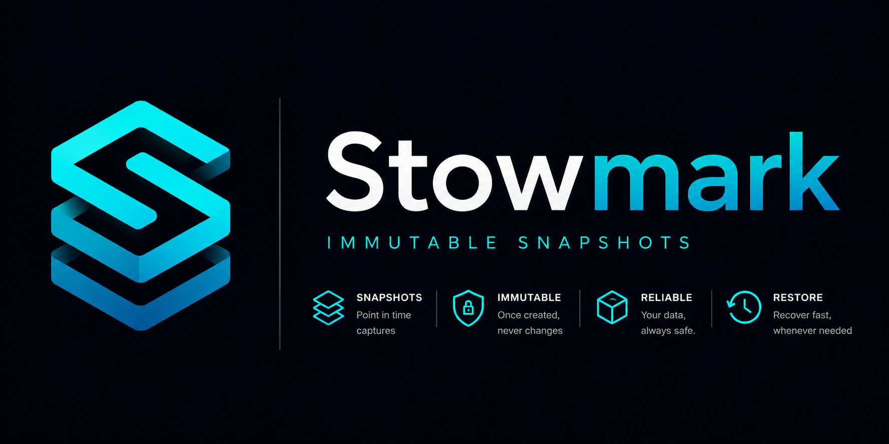

<p align="center">
  
</p>

[](https://github.com/bruli-lab/stowmark/actions/workflows/release.yml)
[](https://codecov.io/gh/bruli-lab/stowmark)
[](https://goreportcard.com/report/github.com/bruli-lab/stowmark)
[](https://github.com/bruli-lab/stowmark/releases/latest)
[](https://github.com/bruli-lab/stowmark/releases)
[](https://github.com/bruli-lab/stowmark/blob/main/LICENSE)
[](https://github.com/bruli-lab/stowmark/blob/main/go.mod)

[Website](https://stowmark.dev) ·
[Releases](https://github.com/bruli-lab/stowmark/releases) ·
[Issues](https://github.com/bruli-lab/stowmark/issues)

---

Stowmark is a lightweight backup tool that stores directory snapshots in a local, SSH-hosted, SMB-hosted,
S3-compatible, Google Cloud Storage or WebDAV-hosted immutable-style repository.

Files are identified by their SHA-256 hash and stored only once. Each snapshot is represented by a manifest containing
the source path, creation time and references to its files.

> **Note**
>
> Stowmark is under active development. The repository format and command-line
> interface may change before the first stable release.

## Features

- Content-addressed object storage using SHA-256.
- Deduplication of unchanged files between snapshots.
- Optional `gzip`, `zstd`, `lz4` and `xz` compression.
- Separate JSON manifest for every snapshot.
- Snapshot listing ordered from newest to oldest.
- Inspection of a snapshot and all its files.
- Integrity verification using SHA-256 hashes.
- Local repositories with no external service required.
- Remote repositories over SSH/SFTP using public-key authentication.
- Remote repositories over SMB using password authentication.
- Remote repositories in Amazon S3 and S3-compatible object storage.
- Remote repositories in Google Cloud Storage using Application Default Credentials.
- Remote repositories over WebDAV using username and password authentication.
- Linux builds for `amd64` and `arm64`.
- Debian packages generated with GoReleaser.

## Installation

### Debian package

Download the package for your architecture from the
[latest GitHub release](https://github.com/bruli-lab/stowmark/releases/latest)
and install it with:

```bash
sudo dpkg -i stowmark_*.deb
```

### Build from source

Requirements:

- Go 1.26 or newer.
- Git.

```bash
git clone https://github.com/bruli-lab/stowmark
cd stowmark

go build -o stowmark ./cmd/cli
sudo install -m 0755 stowmark /usr/local/bin/stowmark
```

Check the installation:

```bash
stowmark --help
```

## Quick start

Create a new Stowmark repository:

```bash
stowmark init /srv/backups/stowmark
```

Create a repository using compression:

```bash
stowmark init /srv/backups/stowmark \
  --compression zstd \
  --level 3
```

Create a snapshot of a directory:

```bash
stowmark snapshot create ~/documents \
  --repo /srv/backups/stowmark
```

List the available snapshots:

```bash
stowmark snapshot list \
  --repo /srv/backups/stowmark
```

Inspect a snapshot manifest:

```bash
stowmark snapshot get \
  --id <snapshot-id> \
  --repo /srv/backups/stowmark
```

Verify that every object referenced by a snapshot is present and unmodified:

```bash
stowmark snapshot verify \
  --id <snapshot-id> \
  --repo /srv/backups/stowmark
```

Restore a snapshot:

```bash
stowmark snapshot restore \
  --id <snapshot-id> \
  --repo /srv/backups/stowmark
```

## SSH repositories

Stowmark can store a repository on a remote server over SSH. The source directory and restored files remain on the
local machine; repository configuration, objects and snapshot manifests are read and written remotely over SFTP.

Set the private key used to authenticate with the SSH server:

```bash
export STOWMARK_SSH_PRIVATE_KEY="$HOME/.ssh/id_ed25519"
```

Use an SSH repository URL anywhere that `--repo` or the repository argument is accepted:

```text
ssh://<user>@<host>[:<port>]/<absolute-path>
```

Initialize a remote repository:

```bash
stowmark init ssh://backup@example.com/srv/backups/stowmark
```

Create and list snapshots:

```bash
stowmark snapshot create ~/documents \
  --repo ssh://backup@example.com/srv/backups/stowmark

stowmark snapshot list \
  --repo ssh://backup@example.com/srv/backups/stowmark
```

Verify and restore a remote snapshot:

```bash
stowmark snapshot verify \
  --id <snapshot-id> \
  --repo ssh://backup@example.com/srv/backups/stowmark

stowmark snapshot restore \
  --id <snapshot-id> \
  --repo ssh://backup@example.com/srv/backups/stowmark
```

The SSH user must have permission to create and modify the repository directory. The SSH server must provide the SFTP
subsystem. Password authentication is not used.

## SMB repositories

Stowmark can store a repository on an SMB share. The source directory and restored files remain on the local machine;
repository configuration, objects and snapshot manifests are read and written remotely over SMB.

Set the password used to authenticate with the SMB server:

```bash
export STOWMARK_SMB_PASSWORD="<password>"
```

Use an SMB repository URL anywhere that `--repo` or the repository argument is accepted:

```text
smb://<user>@<host>[:<port>]/<share>[/<path>]
```

Initialize a repository on an SMB share:

```bash
stowmark init smb://backup@example.com/backups/stowmark
```

Create and list snapshots:

```bash
stowmark snapshot create ~/documents \
  --repo smb://backup@example.com/backups/stowmark

stowmark snapshot list \
  --repo smb://backup@example.com/backups/stowmark
```

Verify and restore an SMB snapshot:

```bash
stowmark snapshot verify \
  --id <snapshot-id> \
  --repo smb://backup@example.com/backups/stowmark

stowmark snapshot restore \
  --id <snapshot-id> \
  --repo smb://backup@example.com/backups/stowmark
```

The SMB user must have permission to create, read, modify and remove files and directories in the repository path.
The share name is the first path component after the host; any remaining components identify the repository directory
inside the share.

## S3 repositories

Stowmark can store a repository in Amazon S3 or an S3-compatible object storage service. The source directory and
restored files remain on the local machine; repository configuration, objects and snapshot manifests are stored as
objects in the selected bucket.

Set the credentials and region used to connect to S3:

```bash
export AWS_ACCESS_KEY="<access-key>"
export AWS_SECRET_ACCESS_KEY="<secret-key>"
export AWS_REGION="<region>"
```

Use an S3 repository URL anywhere that `--repo` or the repository argument is accepted:

```text
s3://<bucket>/<repository-path>
```

Initialize a repository in Amazon S3:

```bash
stowmark init --repo s3://stowmark-backups/home-server
```

Create and list snapshots:

```bash
stowmark snapshot create ~/documents \
  --repo s3://stowmark-backups/home-server

stowmark snapshot list \
  --repo s3://stowmark-backups/home-server
```

Verify and restore an S3 snapshot:

```bash
stowmark snapshot verify \
  --id <snapshot-id> \
  --repo s3://stowmark-backups/home-server

stowmark snapshot restore \
  --id <snapshot-id> \
  --repo s3://stowmark-backups/home-server
```

For an S3-compatible service with a custom endpoint, set the endpoint and enable path-style addressing when required:

```bash
export STOWMARK_S3_ENDPOINT="http://localhost:5000"
export STOWMARK_S3_PATH_STYLE="true"
```

For example, a local development repository using the `stowmark` bucket and the `backups` repository path is
initialized with:

```bash
stowmark init --repo s3://stowmark/backups
```

`STOWMARK_S3_ENDPOINT` and `STOWMARK_S3_PATH_STYLE` are optional and should normally be omitted when connecting to
Amazon S3. The configured credentials must allow Stowmark to read, create and inspect objects in the bucket. The bucket
must already exist; Stowmark creates the repository objects under the path specified in the URL.

## Google Cloud Storage repositories

Stowmark can store a repository natively in Google Cloud Storage (GCS). The source directory and restored files remain
on the local machine; repository configuration, objects and snapshot manifests are stored as objects in the selected
bucket.

Stowmark uses Google Application Default Credentials (ADC). When running outside Google Cloud, authenticate with a
service account credentials file:

```bash
export GOOGLE_APPLICATION_CREDENTIALS="/path/to/service-account.json"
```

For local development against a real GCS bucket, ADC can also be configured with the Google Cloud CLI:

```bash
gcloud auth application-default login
```

When running on Google Compute Engine, Google Kubernetes Engine or Cloud Run, Stowmark can use the identity assigned to
the workload, so `GOOGLE_APPLICATION_CREDENTIALS` does not need to be set.

Use a GCS repository URL anywhere that `--repo` or the repository argument is accepted:

```text
gcs://<bucket>/<repository-path>
```

Initialize a repository in Google Cloud Storage:

```bash
stowmark init --repo gcs://stowmark-backups/home-server
```

Create and list snapshots:

```bash
stowmark snapshot create ~/documents \
  --repo gcs://stowmark-backups/home-server

stowmark snapshot list \
  --repo gcs://stowmark-backups/home-server
```

Verify and restore a GCS snapshot:

```bash
stowmark snapshot verify \
  --id <snapshot-id> \
  --repo gcs://stowmark-backups/home-server

stowmark snapshot restore \
  --id <snapshot-id> \
  --repo gcs://stowmark-backups/home-server
```

For local development with a GCS emulator, set its JSON API endpoint:

```bash
export STOWMARK_GCS_ENDPOINT="http://localhost:4443/storage/v1/"

stowmark init --repo gcs://stowmark/backups
```

`STOWMARK_GCS_ENDPOINT` is optional and should be omitted when connecting to Google Cloud Storage. Authentication is
disabled when a custom endpoint is configured. The bucket must already exist; Stowmark creates the repository objects
under the path specified in the URL. For GCS itself, the active identity must have permission to read, create and
inspect objects in the bucket.

## WebDAV repositories

Stowmark can store a repository on a WebDAV server. The source directory and restored files remain on the local
machine; repository configuration, objects and snapshot manifests are read and written remotely over WebDAV.

Set the username and password used to authenticate with the WebDAV server:

```bash
export STOWMARK_WEBDAV_USERNAME="<username>"
export STOWMARK_WEBDAV_PASSWORD="<password>"
```

Use a WebDAV repository URL anywhere that `--repo` or the repository argument is accepted:

```text
webdav://<host>[:<port>]/<repository-path>
webdavs://<host>[:<port>]/<repository-path>
```

The `webdav://` scheme connects over HTTP and is intended for local development or trusted networks. Use
`webdavs://` to connect over HTTPS in production so that credentials and repository data are encrypted in transit.

Initialize a WebDAV repository:

```bash
stowmark init --repo webdavs://dav.example.com/backups/stowmark
```

Create and list snapshots:

```bash
stowmark snapshot create ~/documents \
  --repo webdavs://dav.example.com/backups/stowmark

stowmark snapshot list \
  --repo webdavs://dav.example.com/backups/stowmark
```

Verify and restore a WebDAV snapshot:

```bash
stowmark snapshot verify \
  --id <snapshot-id> \
  --repo webdavs://dav.example.com/backups/stowmark

stowmark snapshot restore \
  --id <snapshot-id> \
  --repo webdavs://dav.example.com/backups/stowmark
```

For example, a local development server listening on port `18080` can be used with:

```bash
export STOWMARK_WEBDAV_USERNAME="stowmark"
export STOWMARK_WEBDAV_PASSWORD="stowmark"

stowmark init --repo webdav://localhost:18080/backups
```

Both credential variables must be set together. The WebDAV user must have permission to create, read, update, move
and remove files and collections under the repository path.

## Commands

| Command                                                   | Description                           |
|-----------------------------------------------------------|---------------------------------------|
| `stowmark init <repository>`                              | Initialize a new repository.          |
| `stowmark snapshot create <source> --repo <repository>`   | Create a snapshot of a directory.     |
| `stowmark snapshot list --repo <repository>`              | List snapshots from newest to oldest. |
| `stowmark snapshot get --id <id> --repo <repository>`     | Display a snapshot manifest.          |
| `stowmark snapshot verify --id <id> --repo <repository>`  | Verify snapshot integrity.            |
| `stowmark snapshot restore --id <id> --repo <repository>` | Restore snapshot.                     |

Run the built-in help for the complete set of options:

```bash
stowmark --help
stowmark snapshot --help
stowmark snapshot create --help
```

## Compression

Compression is selected when the repository is initialized. Stowmark currently supports:

| Type   | Description                                      | Compression level |
|--------|--------------------------------------------------|-------------------|
| `none` | Store objects without compression.               | Not used          |
| `gzip` | Widely supported general-purpose compression.    | Supported         |
| `zstd` | Fast compression with a good compression ratio.  | Supported         |
| `lz4`  | Very fast compression and decompression.         | Supported         |
| `xz`   | Slower compression with a high compression ratio. | Not used          |

For example:

```bash
stowmark init /srv/backups/stowmark-gzip --compression gzip --level 6
stowmark init /srv/backups/stowmark-zstd --compression zstd --level 3
stowmark init /srv/backups/stowmark-lz4 --compression lz4 --level 0
stowmark init /srv/backups/stowmark-xz --compression xz
```

The selected compression is applied to every object in the snapshot and recorded in its manifest. Compression is
transparent during restoration: Stowmark decodes each stored object before writing the original file.

## Repository format

A repository currently has the following structure:

```text
repository/
├── config.json
├── objects/
│   ├── 00/
│   ├── 01/
│   └── ...
└── snapshots/
    ├── <snapshot-id>.json
    └── ...
```

The format is identical for local, SSH, SMB, S3, GCS and WebDAV repositories. In S3 and GCS, directories are represented
by object key prefixes rather than physical folders.

### Objects

Objects are stored using the SHA-256 hash of their encoded representation. The first two characters are used as the
directory name and the remaining characters as the file name:

```text
objects/<first-two-hash-characters>/<remaining-hash-characters>
```

When two snapshots contain the same file content encoded with the same compression settings, they both reference the
same stored object. The same original content encoded differently produces a different object and hash.

### Snapshot manifests

Each snapshot is stored as a JSON manifest containing:

- A unique snapshot ID.
- The snapshot creation time.
- The original source path.
- The compression type and level used by the snapshot.
- The path, SHA-256 hash and size of every file.

The manifest references objects but does not duplicate their contents.

## Integrity verification

The `snapshot verify` command reads each object referenced by the manifest and checks:

1. The object exists.
2. Its calculated SHA-256 hash matches the manifest.

The command exits with an error when any referenced file fails verification, making it suitable for scripts and
scheduled checks.

## Development

Install [Task](https://taskfile.dev/) and run:

```bash
task check
```

Available development tasks include:

```bash
task fmt
task fix
task lint
task security
task test
```

The test task enables the race detector and generates `coverage.out`:

```bash
task test
go tool cover -func=coverage.out
go tool cover -html=coverage.out
```

## Releases

Releases are created from `main` using Semantic Release and GoReleaser.

A successful release produces:

- Linux binaries for `amd64` and `arm64`.
- Debian packages.
- SHA-256 checksums.
- A GitHub release with the generated assets.

See all published versions on the
[GitHub Releases page](https://github.com/bruli-lab/stowmark/releases).

## Roadmap

Planned areas of development include:

- Remote storage drivers.
- Repository maintenance and garbage collection.
- More installation formats and platforms.

## Contributing

Issues and pull requests are welcome.

Before opening a pull request, run:

```bash
task check
```

Use [GitHub Issues](https://github.com/bruli-lab/stowmark/issues) for bug reports, feature requests and design
discussions.

## License

Stowmark is licensed under the
[Apache License 2.0](https://github.com/bruli-lab/stowmark/blob/main/LICENSE).
